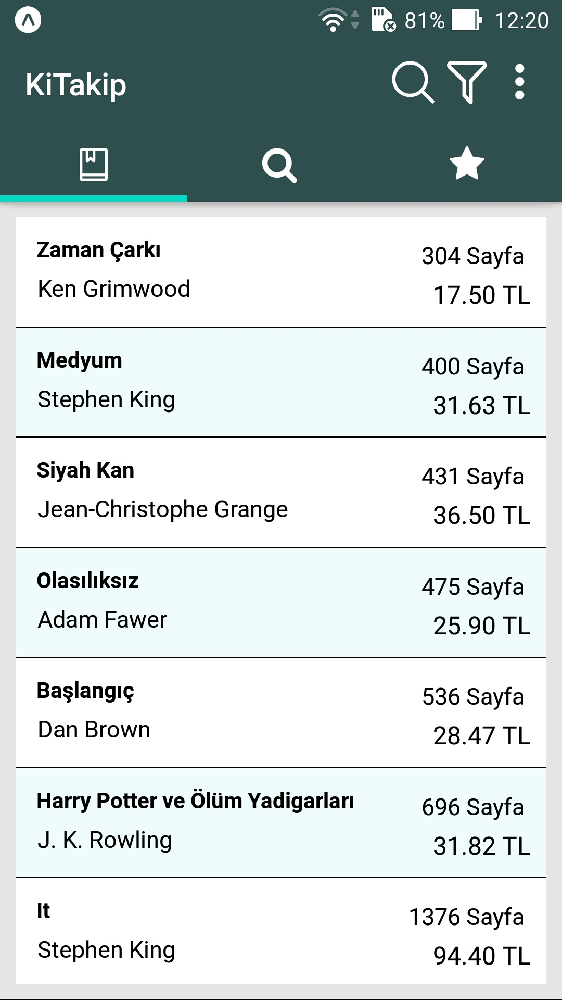
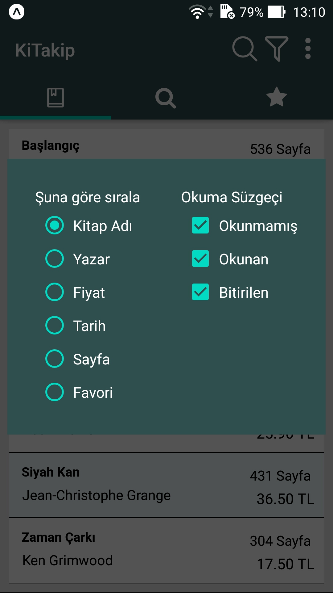
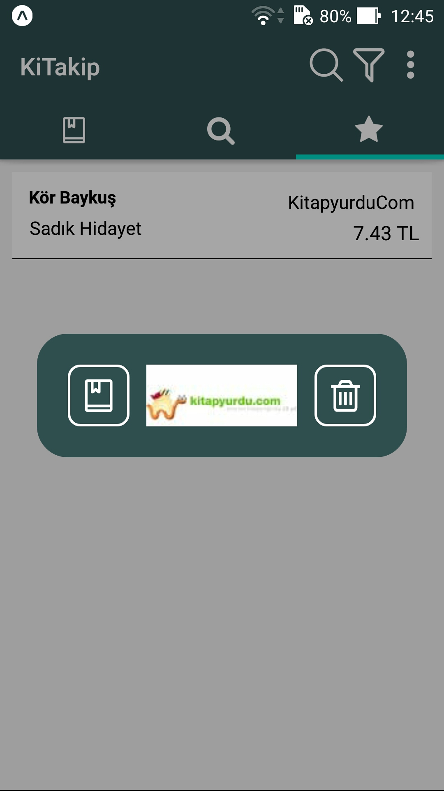
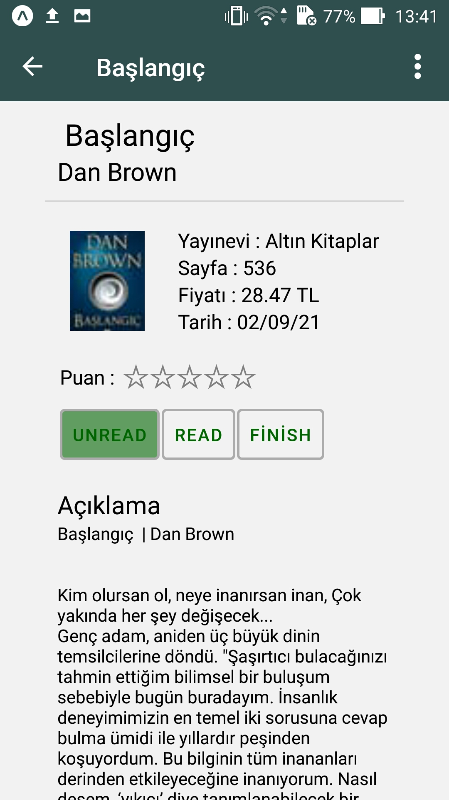
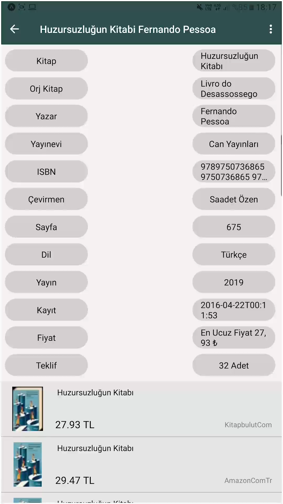

# KiTakip Kitap Takip Uygulaması

Bu projede kullanıcılara kitap arama, fiyat araştırma ve kütüphane sistemini kullanabileceği Mobil uygulama olan KiTakip Kitap Takip Uygulaması yapılmıştır.
Kullanıcıların kitap arayıp, istedikleri kitabın sitesine gidip satın alabildikleri ve aynı zamanda mobil olarak telefonunuza kaydedeceğiniz ve
kendi mobil kütüphanenizi kurabileceğiniz bir uygulama tasarlandı.

Projede Cheerio ile WebScraping - React-Native Navigation - AsyncStorage kullanıldı.

  
  
  

 
 

  
  
  
  

