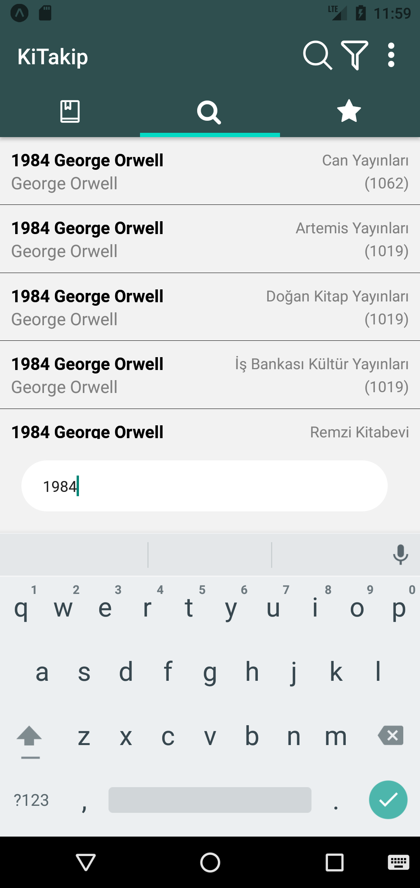

# KiTakip - Book Tracking Application

This project is a mobile application called **KiTakip**, designed for users to **search for books, compare prices, and manage their personal library**.

With KiTakip, users can:
- Search for books and visit the respective websites to purchase them.
- Save books to their mobile library.
- Organize and track their own collection.

### Technologies Used:
- **Cheerio** for Web Scraping.
- **React Native Navigation** for smooth user experience.
- **AsyncStorage** for local data storage.

## Screenshots:

  
  
  

 

  
  
  

# KiTakip Kitap Takip Uygulaması

Bu projede kullanıcılara kitap arama, fiyat araştırma ve kütüphane sistemini kullanabileceği Mobil uygulama olan KiTakip Kitap Takip Uygulaması yapılmıştır.
Kullanıcıların kitap arayıp, istedikleri kitabın sitesine gidip satın alabildikleri ve aynı zamanda mobil olarak telefonunuza kaydedeceğiniz ve
kendi mobil kütüphanenizi kurabileceğiniz bir uygulama tasarlandı.

Projede Cheerio ile WebScraping - React-Native Navigation - AsyncStorage kullanıldı.

  
  
  

 
 

  
  
  
  

